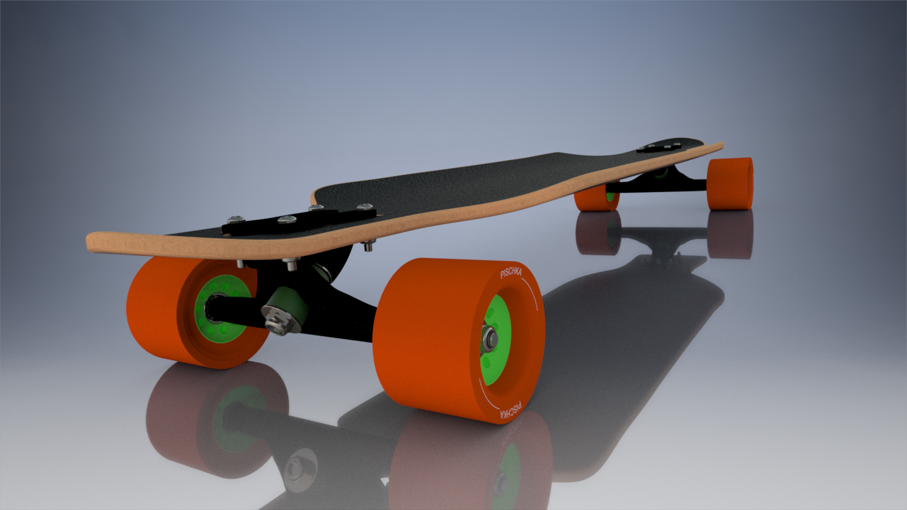
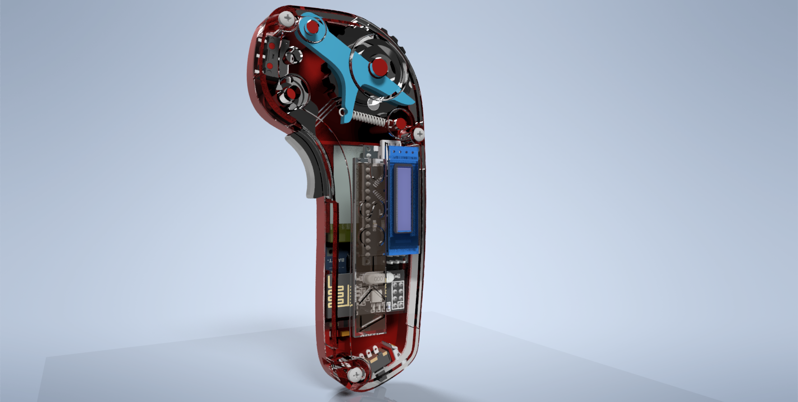
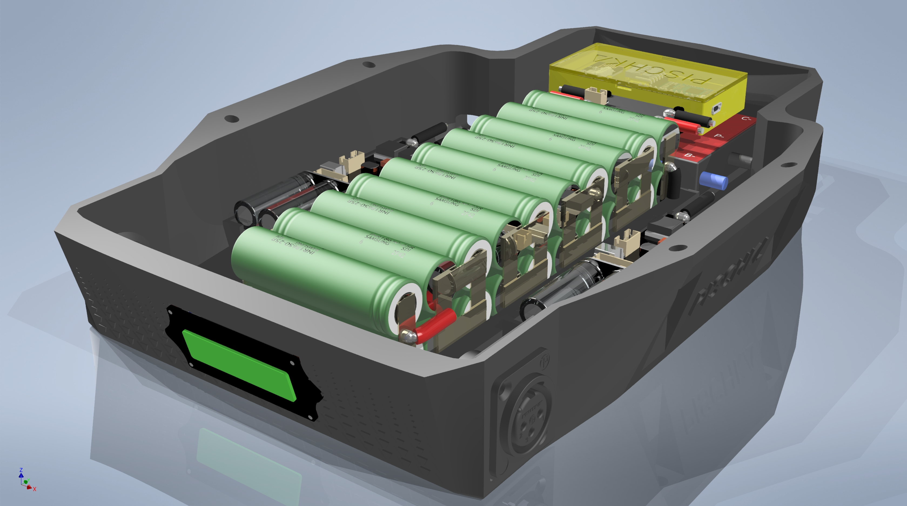
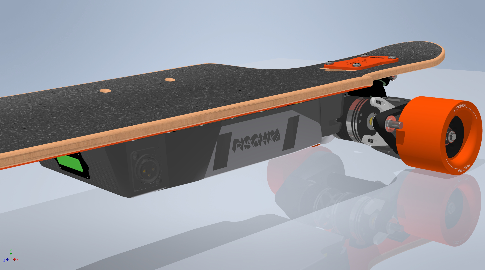

# Electric-Board

Electric Longboard source files, functions and CAD-files.

This is the source from my own electric DIY Longboard that I made between 2018 and 2019. Since I'm not planning to go to market with it, I'm making it available for everyone to access it. That is all RAW data and files, unedited, unsorted. Just be considerable of the Licensing.

ENJOY!

## Copyright
by Petar Hristov, licensed under [Apache License 2.0](https://opensource.org/licenses/Apache-2.0).
